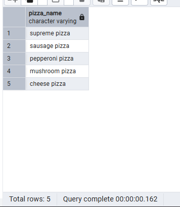
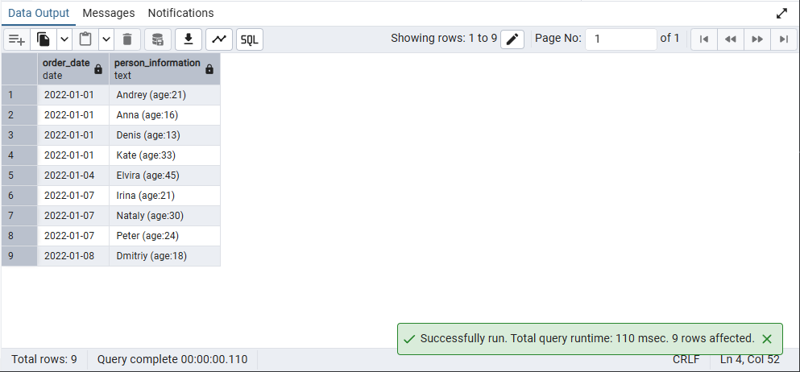

## Day 01

## Exercise 00 - Let’s make UNION dance

```sql
SELECT id AS object_id, pizza_name AS object_name FROM menu
UNION ALL
SELECT id, name FROM person
ORDER BY object_id, object_name;
```


## Exercise 01 - UNION dance with subquery

```sql
SELECT object_name FROM (
    SELECT 'person' AS source, name AS object_name FROM person
    UNION ALL
    SELECT 'menu', pizza_name FROM menu
) AS combined
ORDER BY 
    CASE WHEN source = 'person' THEN 0 ELSE 1 END,
    object_name;
```


## Exercise 02 - Duplicates or not duplicates

```sql
SELECT pizza_name
FROM menu
GROUP BY pizza_name
ORDER BY pizza_name DESC;
```



## Exercise 03 - “Hidden” Insights

```sql
SELECT po.order_date AS action_date, po.person_id
FROM person_order po
INNER JOIN person_visits pv
ON po.order_date = pv.visit_date AND po.person_id = pv.person_id
ORDER BY action_date ASC, person_id DESC;
```


## Exercise 04 - Difference? Yep, let's find the difference between multisets.


```sql
(
    SELECT person_id
    FROM person_order
    WHERE order_date = '2022-01-07'
)
EXCEPT ALL
(
    SELECT person_id
    FROM person_visits
    WHERE visit_date = '2022-01-07'
);
```


## Exercise 05 - Did you hear about Cartesian Product?

```sql
SELECT p.id AS "person.id", p.name AS "person.name", p.age, p.gender, p.address,
       pz.id AS "pizzeria.id", pz.name AS "pizzeria.name", pz.rating
FROM person p
CROSS JOIN pizzeria pz
ORDER BY p.id, pz.id;
```


## Exercise 06 - Lets see on “Hidden” Insights

```sql
SELECT po.order_date AS action_date, p.name AS person_name
FROM person_order po
JOIN person_visits pv ON po.order_date = pv.visit_date AND po.person_id = pv.person_id
JOIN person p ON p.id = po.person_id
ORDER BY action_date ASC, person_name DESC;
```


## Exercise 07 - Just make a JOIN

```sql
SELECT po.order_date, p.name || ' (age:' || p.age || ')' AS person_information
FROM person_order po
JOIN person p ON po.person_id = p.id
ORDER BY po.order_date ASC, person_information ASC;
```


## Exercise 08 - Migrate JOIN to NATURAL JOIN

```sql
SELECT po.order_date, p.name || ' (age:' || p.age || ')' AS person_information
FROM person_order po
NATURAL JOIN person p
ORDER BY po.order_date ASC, person_information ASC;
```



## Exercise 09 - IN versus EXISTS

```sql
SELECT name FROM pizzeria
WHERE id NOT IN (
    SELECT DISTINCT pizzeria_id FROM person_visits
);

-- day01_ex09_not_exists.sql
SELECT name FROM pizzeria pz
WHERE NOT EXISTS (
    SELECT 1 FROM person_visits pv
    WHERE pv.pizzeria_id = pz.id
);
```


## Exercise 10 - Global JOIN

```sql
SELECT p.name AS person_name,
       m.pizza_name,
       pz.name AS pizzeria_name
FROM person_order po
JOIN person p ON po.person_id = p.id
JOIN menu m ON po.menu_id = m.id
JOIN pizzeria pz ON m.pizzeria_id = pz.id
ORDER BY person_name ASC, pizza_name ASC, pizzeria_name ASC;
```
